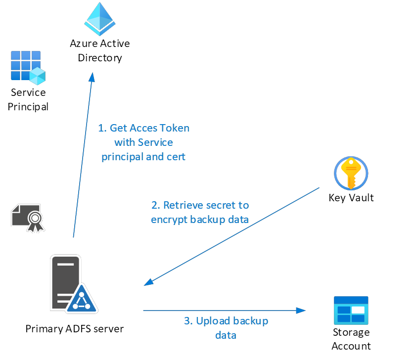
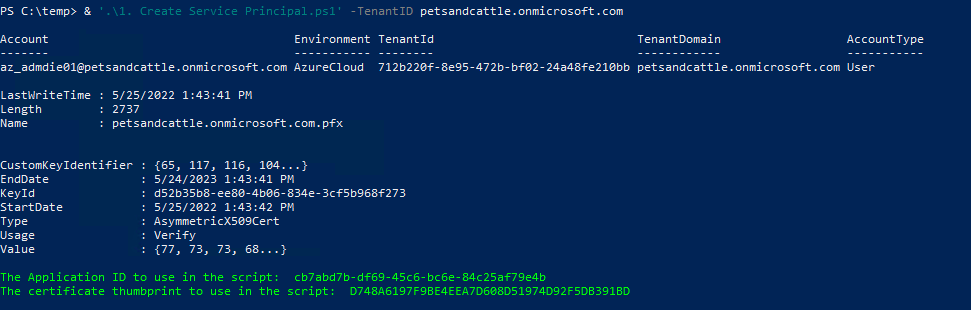
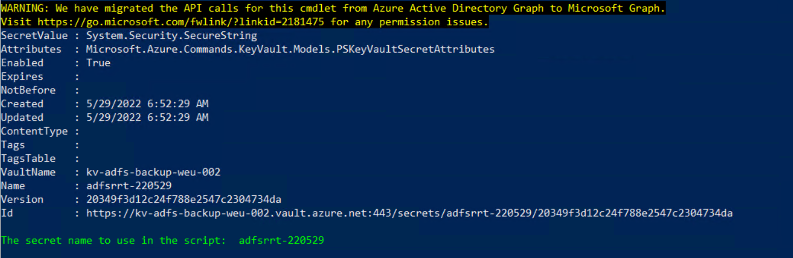
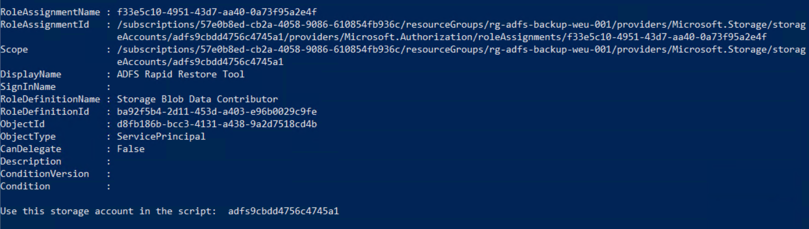
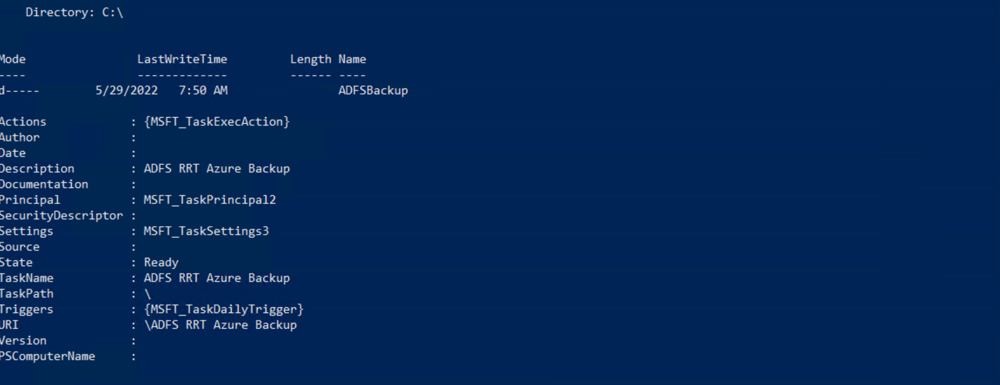

# ADFS Backup to Azure with Rapid Restore Tool

Creating a backup with the ADFS rapid restore tool requires to specify credentials to connect to an Azure storage account and a password to encrypt the backup data. Obviously we don't want to store those in the script so I created something to use a Service Principal to connect to the storage account and an Azure Key Vault to store the encryption key. Obviously I provided Powershell scripts to deploy all this for your convenience.

>NOTE All of the configuration steps should be executed on the primary ADFS server.

## Create service principal and certificate for authentication to Azure
You will need a service principal to access the Key Vault and the storage account. Authentication will be done using a self signed certificate.

In order to create the service principal you will ned to install the AzureAD powershell module on the ADFS server.

  >Install-Module AzureAD -force

Download the ADFSBackup_CreateServicePrincipal.ps1 script and execute it with the TenantID parameter (mandatory) to specify your tenant. Make sure to start Powershell as Administrator since the certificate will be stored in the computer store.

  >.\ADFSBackup_CreateServicePrincipal.ps1 -tenantid <tenantid>

Save the Application ID and the certificate thumbprint to use in the rest of the configuration.

## Create an Azure KeyVault

The KeyVault will be used to store the encryption key for the backup data. The Rapid Restore Tool needs this key at the time the backup runs. I've seen this key to be stored in the backup script which is... well... ugly to say the least.

For this script you will need to install some Azure Powershell modules.
>Foreach ($module in ("Az.KeyVault", "Az.Storage", "Az.Accounts", "Az.Resources"))
{
  Install-Module $module -Force
}

The ADFSBackup_CreateKeyVault.ps1 will create a KeyVault (obviously) and limit network communications to a specified CIDR or vNet (or both). The access model will be set to RBAC and the service principal will be granted the 'Key Vault Secrets User' role.

First you need to connect to Azure:
>Connect-AzureAccount -TenantID \<yourtenant>

Download the ADFSBackup_CreateKeyVault.ps1 script and execute it with the required parameters:

- rgname -> Resource Group
- location -> Azure region
- kvname -> Key Vault name
- appid -> The id of the service principal created in the previous step

To allow communications to the Key Vault you can use these switches:
- KVFW_CIDR -> You should add your current public IP to allow the creation of a secret.
- subnetid -> The Resource ID of the virtual network subnet. This is a string, not an array. I am assuming that only the primary ADFS server will need access for doing the backup.

>NOTE To get the resource Id for your vnets you can use 'get-azvirtualnetwork | Get-AzVirtualNetworkSubnetConfig | fl name,id'.

The script will output the name of the secret to use in the rest of the configuration. Make sure to write that down somewhere.

## Create a storage account

The storage account will be used to store the ADFS backup. The RRT manages access through a pscredential object (Get-credential) which doesn't allow for the use of a certificate. And we don't want to hardcode credentials in the script so I've chosen to upload the files after creating the backup on the local filesystem.

>NOTE I am assuming you are running the scripts in order so you should already have the needed Powershell modules ("Az.KeyVault", "Az.Storage", "Az.Accounts", "Az.Resources").

The ADFSBackup_CreateStorageAccount.ps1 will create a storage account, grant the SP 'Storage Blob Data Contributor' permissions and limit network access. The script will generate the name for the storage account (like it or not).

The script should be executed with the required parameters:

- rgname -> Resource Group
- location -> Azure region
- appid -> The id of the service principal

To allow communications to the Key Vault you can use these switches:
- SAFW_CIDR -> Your public IP address(range)
- subnet -> The Resource ID of the virtual network subnet.

The script will show the name of the storage account that you will need in the next step.

## Schedule the ADFS backup

This is the final part of the configuration. The ADFSBackup_CreateSchedule.ps1 script will download the ADFS Rapid Restore Tool, install it and create a scheduled task to run the backup.

The script needs a whole bunch of parameters:

- TenantID -> The ID of your tenant
- appid -> The application id of the service principal that was outputed from the first script
- thumbprint -> The thumbprint of the selfsigned certificate
- BackupTargetFolder -> The path to a directory on the local filesystem to store the backup files
- ADFSServiceAccount -> The name of the service account (or gmsa) that runs the ADFS service. It is used to backup the DKM. This should be in the format of <domain>\<accountname> (e.g. contoso\gmsa_adfs$) (Don't forget the $ for a GMSA).
- storageaccount -> The name of the storage account (outputed by the CreateStorageAccount script)
- rgname -> The name of the resource group for the storage account
- KeyVault -> The name of the Key Vault (outputed by the CreateKeyVault script)
- secretname -> The name of the secret (outputed by the CreateKeyVault script)

The script will create a scheduled task with the name 'ADFS RRT Azure Backup'.

The script that is used to perform the backup is also copied to the storage account. This contains the name of the secret that is used for encrypting the data. Only the latest backup will be copied to the storage account, overwriting the previous version.